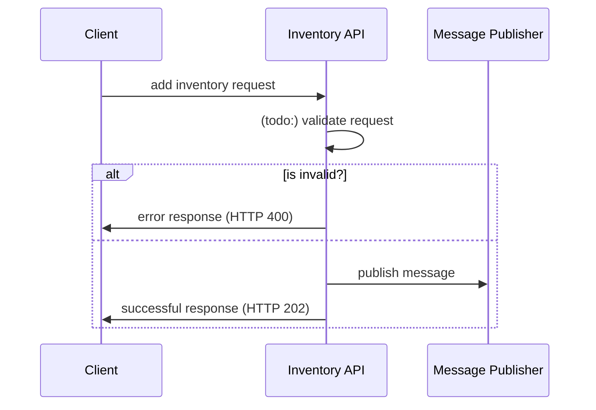

# Inventory API

```mermaid
sequenceDiagram
    Client ->> Inventory API: add inventory request
    Inventory API ->> Inventory API: (todo:) validate request
    alt is invalid?
        Inventory API ->> Client: error response (HTTP 400)
    else
        Inventory API ->> Message Publisher: publish message
        Inventory API ->> Client: successful response (HTTP 202)                    
    end    
```

## TODO:
* Add more documentation.
* Add more tests.
* Implement the message reader functionality, and save it into a data store.

